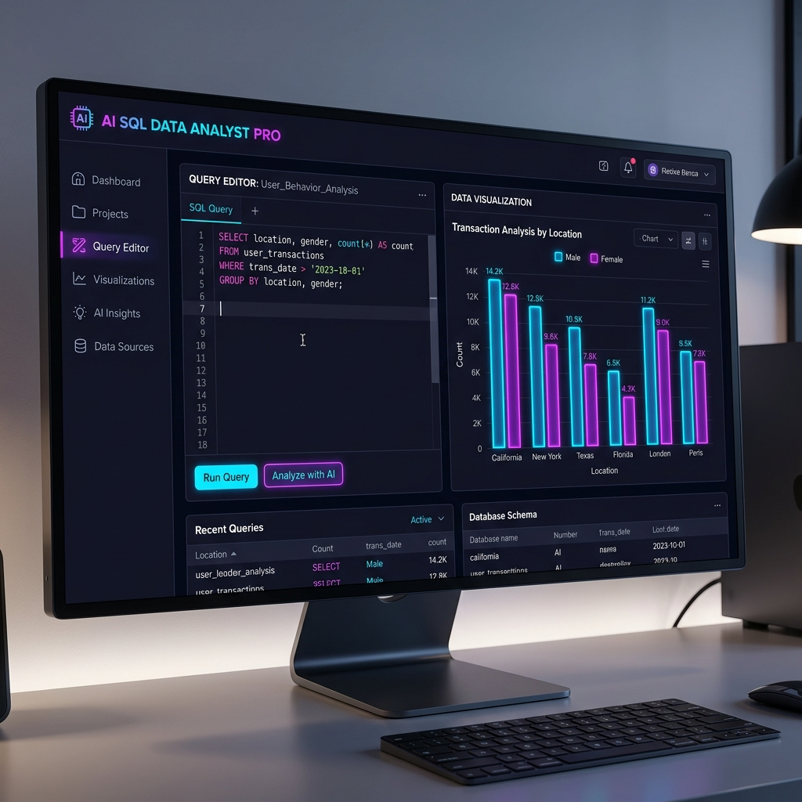

# 🚀 AI SQL Data Analyst PRO

An intelligent data analysis tool that allows users to upload any CSV dataset, ask questions in natural language, and receive SQL queries, results, and visualizations — powered by LLMs.




---

## 📌 Overview

**AI SQL Data Analyst PRO** is an end-to-end AI-powered analytics system that bridges the gap between non-technical users and complex data analysis. It:
- 📂 **Dynamic Data Ingestion**: Converts uploaded CSVs into a structured SQLite database on the fly.
- 🧠 **Natural Language Processing**: Translates human questions into optimized SQL using Llama 3.1.
- ⚡ **Real-time Execution**: Executes queries dynamically and retrieves instant results.
- 📊 **Smart Visualizations**: Automatically generates bar charts for data distributions.

---

## 🎯 Key Features

- **✅ Dynamic CSV Upload**: Upload any dataset; it's automatically converted into a SQLite database.
- **✅ One-Click Quick Queries**: Sidebar buttons for instant actions like *"Show all records"*, *"Count rows"*, or *"Find averages"*.
- **✅ AI-powered SQL Generation**: Leverages **Groq (Llama 3.1)** for high-speed, accurate SQL generation.
- **✅ Smart SQL Cleaning & Fixing**: 
    - **Regex-based Cleaning**: Automatically strips markdown and noise from LLM responses.
    - **Auto-Fix Logic**: Injects missing table names (`FROM data`) and semicolons if omitted by the LLM.
- **✅ Intelligent Data Visualization**: Automatically detects categorical and numerical columns to generate relevant bar charts.
- **✅ Conversation History**: Sidebar tracking of the last 5 queries to maintain session context.
- **✅ Premium UI/UX**: Custom CSS with glassmorphism effects, linear gradients, and a modern dark-mode interface.

---

## 🧠 System Architecture

```text
User Input (CSV + Question)
        ↓
CSV Loader (Pandas)
        ↓
SQLite Database (dynamic.db)
        ↓
Schema Extraction (sqlite_master + PRAGMA)
        ↓
LLM (Groq - Llama 3.1)
        ↓
SQL Query Generation
        ↓
SQL Cleaning (Regex) + Auto Fix (Logic)
        ↓
Execution Engine (SQLite)
        ↓
Result (DataFrame) + Visualization (Matplotlib)
```

---

## 🛠 Tech Stack

| Component | Technology |
| :--- | :--- |
| **Frontend** | Streamlit |
| **LLM Engine** | Groq (Llama 3.1-8b-instant) |
| **Framework** | LangChain |
| **Backend Logic** | Python |
| **Database** | SQLite3 |
| **Data Handling** | Pandas |
| **Visualization** | Matplotlib |

---

## 📂 Project Structure

```text
AiSqlAgent/
├── streamlit_app.py     # Main Web Application (Streamlit)
├── app.py               # CLI/Desktop version fallback
├── insurance.db         # Default sample database
├── insurance.csv        # Sample dataset for testing
├── dynamic.db           # Runtime generated database (excluded by git)
├── .env                 # API Key configuration (GROQ_API_KEY)
├── .gitignore           # Git exclusion rules
├── requirements.txt     # Project dependencies
└── README.md            # Project documentation
```

---

## ⚙️ Installation

### 1. Clone the Repository
```bash
git clone https://github.com/yourusername/ai-sql-analyst.git
cd ai-sql-analyst
```

### 2. Set Up Virtual Environment
```bash
python -m venv venv
venv\Scripts\activate  # Windows
source venv/bin/activate  # macOS/Linux
```

### 3. Install Dependencies
```bash
pip install -r requirements.txt
```

### 4. Configure API Key
Create a `.env` file in the root directory:
```env
GROQ_API_KEY=your_groq_api_key_here
```

---

## ▶️ Run the Application

To launch the web interface:
```bash
streamlit run streamlit_app.py
```

---

## 📊 How to Use

1.  **Step 1: Upload CSV**: Drag and drop any dataset.
2.  **Step 2: Ask Questions**: Type your query (e.g., *"average age by region"*).
3.  **Step 3: View Results**: See the generated SQL, the data table, and an auto-generated chart.

---

## 🧪 Example Queries

| Type | Example |
| :--- | :--- |
| **Aggregation** | *"What is the average insurance charge?"* |
| **Count** | *"Count all rows in the dataset"* |
| **Grouping** | *"Average BMI grouped by region"* |
| **Filtering** | *"Show top 5 oldest people who are smokers"* |

---

## 🔍 Key Design Decisions

- **✔ Schema-driven Prompts**: Dynamically extracts table metadata using `PRAGMA table_info` to provide context to the LLM.
- **✔ UI Theming**: Used custom CSS injection to create a high-end dark-mode experience that exceeds default Streamlit styles.
- **✔ Session Management**: Utilizes `st.session_state` to store query history and maintain "Quick Query" button state.

---

## ⚠️ Limitations

- **LLM Interpretation**: Occasionally, the LLM may misinterpret ambiguous column names if they aren't descriptive.
- **Single-Table**: Currently optimized for single-table analysis.

---

## 🚀 Future Improvements

- 🔹 **Auto Column Suggestions**: Smart hints based on data types.
- 🔹 **Query Explanation**: AI-generated insights explaining the data trends.
- 🔹 **Export Results**: Download results as CSV or Excel.
- 🔹 **Multi-table Support**: Ability to join multiple uploaded CSVs.

---

## 🛡️ License

This project is licensed under the MIT License.

---

**Built by KUMAR C**
